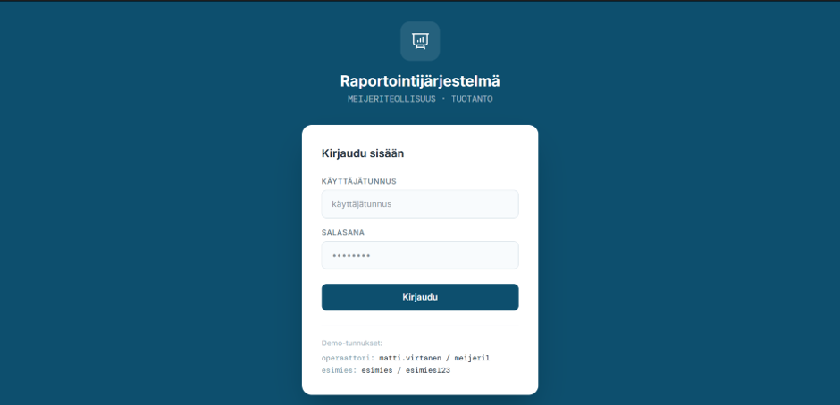
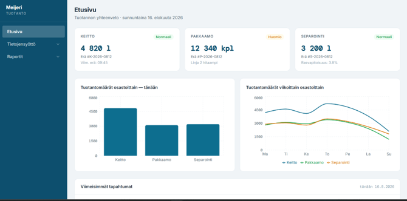
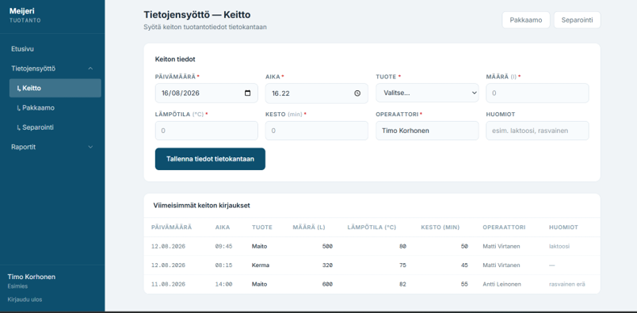
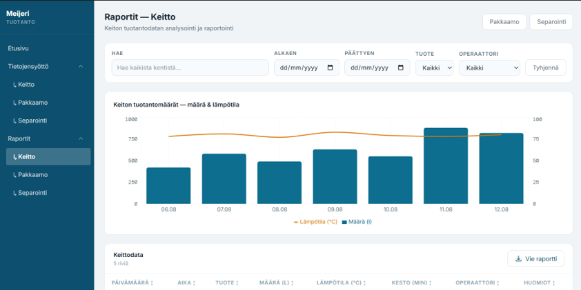

# Raportointijärjestelmä

Tämän projektin tarkoitus on, lisätä dataa, tallentaa dataa ja näyttää dataa. Tämä projekti on tarkoitettu maitotehtaille, jotka tarvitsevat rapotointijärjestelmää.
Projektissa käytin Figmaa, Github Copilotia, nodea, reactia.
Tietokanta on Lokaalisti pyörivässä MySQL-Tietokannassa, jossa on käyttäjät, sekä raportointitiedot kohta.
Projektin FrontEnd on tehty Figmalla ja se sisältää Figmalla tuotettua testidataa.

## Jatkokehitys

Jatkokehityksenä ajattelen lisätä Grafana visualisoinnin, raportin viennin PDF-muotoon, korjata virheitä ja parantaa koodin luettavuutta, Laittaa projekti AWS-Palvelimelle.

## Käyttö-ohje

1.	Asenna XAMPP( jos ei ole asenna täältä: https://www.apachefriends.org/)
2.	Käynnistä Apache palvelin ja MySQL XAMPPissa
3.	Mene selaimessa osoitteeseen http://localhost/phpmyadmin/
4.	Kopioi Schema.sql koodi ja aja se phpMyAdminissa
5.	Kloonaa projekti komennolla git clone https://github.com/stankovvv/raportointij-rjestelma.git
6.	Avaa terminaali ikkuna VS-Codessa ja mene kansioihin backend ja FrontEnd
7.	Aja molemmissa npm i
8.	Käynnistä projekti molemmissa kansioissa komento npm run dev ja paina frontEndin antamasta linkistä.

